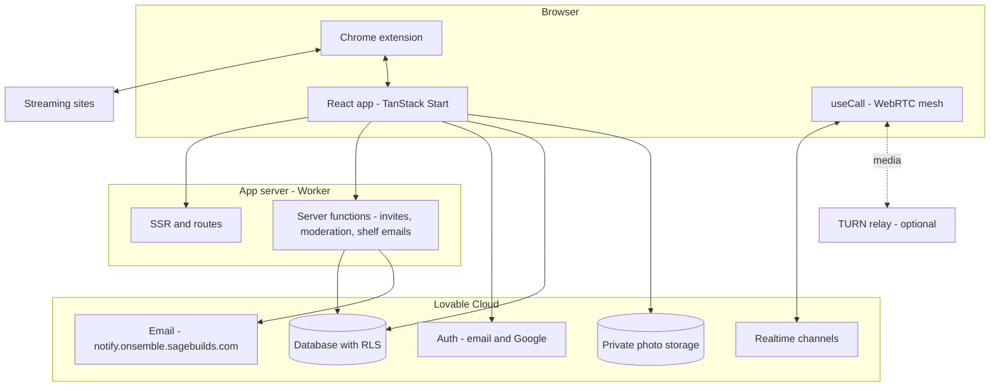
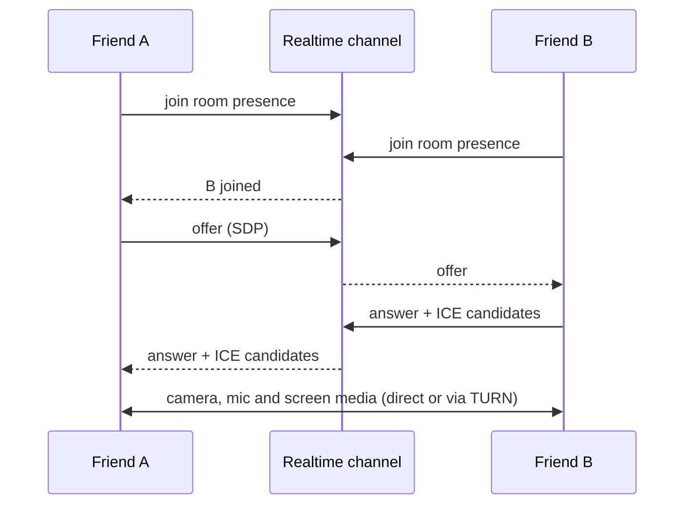
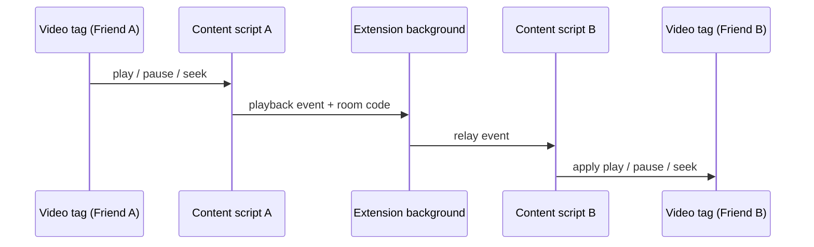
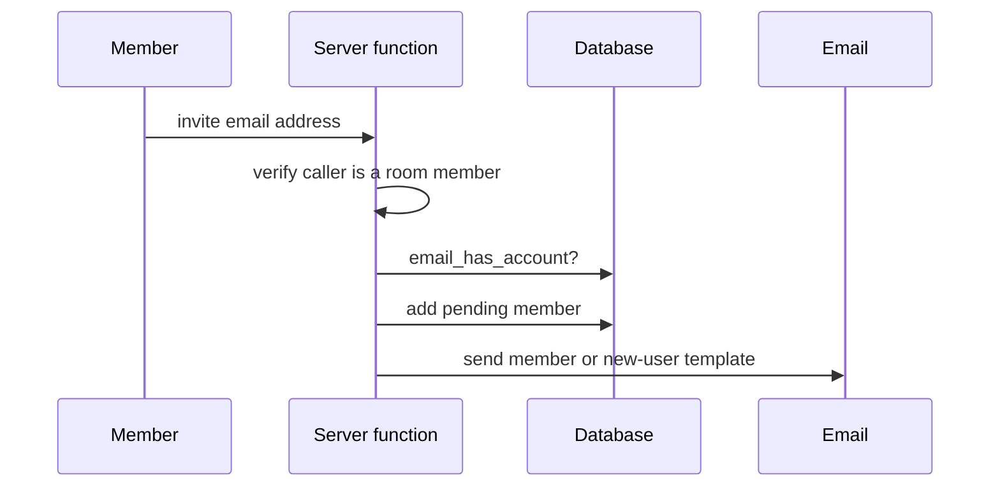
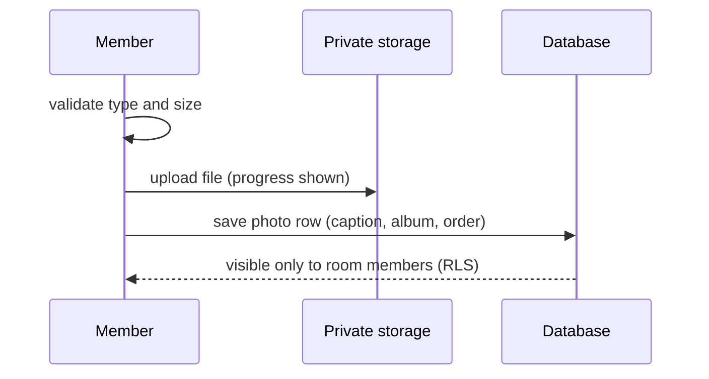

# Onsemble

Onsemble is a place for people who live apart — friends, partners, family — to spend time together online. Each group gets a shared room with live video calling, screen sharing, synced streaming, a shared bookshelf and a private photo album.

Live: https://onsemble.sagebuilds.com

## Features

### Accounts
- Sign up with email and password or with Google (an 18+ confirmation is required).
- Inline validation, friendly error messages, expired-session handling and password reset.
- Profile with display name and avatar, plus a sign-out confirmation step.
- Signed-in users go straight to their home page, which lists all their rooms.

### Rooms
- **Saved rooms:** these persist and can have any number of members. Each has an invite code, a custom emoji, streaming-service preferences and a watch history.
- **Instant rooms:** one-off rooms you join with a code, for guests who don't have an account.
- **Email invites:** registered users get a "join the room" email. New people get a short intro to the app and a sign-up link. Pending invites show in the room.
- **Moderation:** signed-in members can remove guests and lock the room to new joiners. The server checks that only real members can do this.
- **Rooms home page:** shows a slideshow of recent photos from all your rooms.

### Video calling
- Real camera and microphone calls, connecting browsers directly to each other.
- A setup screen before you join, with a camera preview, mic level meter and device pickers. Your choices are remembered.
- Mute, camera on/off, pinning, and a switch between grid and speaker layouts.
- Active-speaker highlighting. Your own voice doesn't highlight your tile on your screen.
- A Connection health panel that explains failures and suggests fixes.
- A relay server is used when the network blocks direct connections, if one is configured.
- Pop-out video (picture-in-picture).

### Screen sharing
- The shared screen shows on the main stage, and the sharer's camera stays visible.
- **Optional screen audio:** includes sound from a tab, a window or the whole system where the browser supports it.
- **Linux, including Firefox:** sound comes from the speakers' "Monitor" source.
- **Tuned for video:** the browser keeps playback smooth, and the camera feed is scaled down while sharing so the screen gets most of the bandwidth.

### Synced streaming (Chrome extension)
- Keeps play, pause and seek in sync on YouTube, Netflix, Disney+, Apple TV+ and Prime Video.
- Each person streams from their own account, so picture quality is unaffected.
- See `chrome-extension/README.md`. A packaged copy is at `public/onsemble-extension.zip`.

### Bookshelf
- Shelve books, movies and shows with a link, cover and note, and mark who each one is for ("for you", "for us" or "for me").
- Items are either Suggestion or Finished. Finished items can have a rating and a short reaction.
- Filter by type, state and who it's for.
- Other members get an email when something is shelved "for you" or "for us".

### Photo album
- A private album for each room, visible to members only.
- Upload several photos at once, with a caption for each, a progress bar and type/size checks.
- Group photos into albums, reorder them by drag-and-drop, and move or delete several at once.
- Open the bookshelf and photos from inside a live call.

### Design
- Bright, colourful landing and dashboard pages.
- Rooms fade into a dark "Theater Mode".
- Works on desktop, tablet and mobile.

### Legal and SEO
- Terms of Service and Privacy Policy pages, with a site footer.
- A sitemap generated from the site's pages, plus `robots.txt`.

## Tech stack

- TanStack Start (React 19, Vite) and Tailwind CSS v4.
- Lovable Cloud for authentication, the database (with row-level security), file storage, realtime signalling and email.
- WebRTC for direct browser-to-browser calls.
- A Chrome extension (Manifest V3) in `chrome-extension/`.

## Architecture



## Data flows

### Joining a call



### Synced playback



### Email invite



### Photo upload



## Configuration

- `TURN_URLS`, `TURN_USERNAME` and `TURN_CREDENTIAL` are optional secrets for a relay server. Without them, calls may fail on strict networks.

## Known limitations

- Calls use direct connections between every pair of people, so quality drops in groups larger than about 4.
- The extension is installed manually ("Load unpacked") and isn't on the Chrome Web Store yet.

## Development

```sh
bun install
bun run dev
```

Built with [Lovable](https://lovable.dev).
